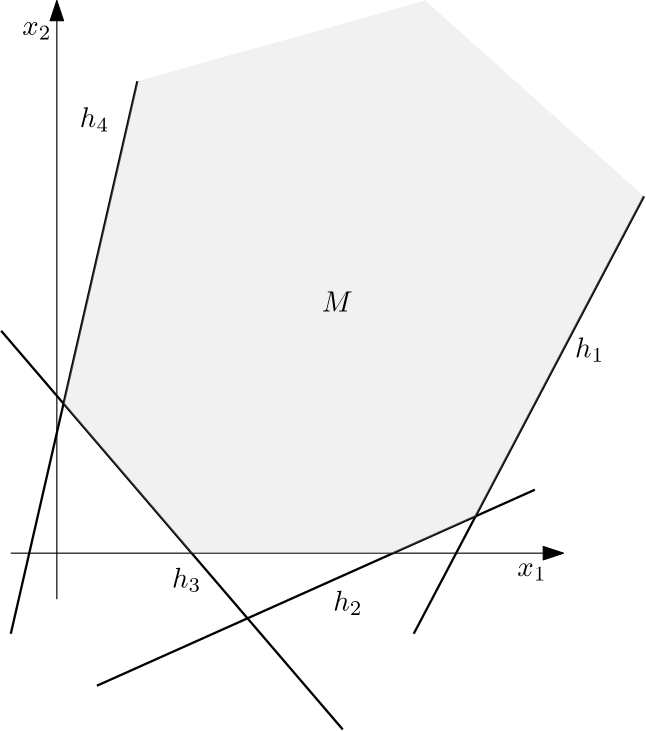

# Introduction

TODO

# Preliminaries

## Notation

## Linear Programming

*[ Where to find detailed descriptions of linear programming ]*

For a more detailed discussion of LP see:
[ Matousek, Chvatal ]

*[What is optimization and optimization problem?]*

**Definition** (Optimization problem) A (mathematical) optimization problem is
is a problem of the form
$$
\begin{align*}
    \text{minimize}\;&  f(x) \\
    \text{subject to}\;&    g_i(x) \le b_i \quad i = 1, 2, \ldots, m
\end{align*}
$$
where $n \in \mathbb{N}$, $x \in \mathbb{R}^n$ is a vecfor of *optimization variables* , the function $f : \mathbb{R}^n \to \mathbb{R}$ is called the *objective function* and the functions $g_i$ are *constraint* functions for some *bounds* $b_i$. 

Note that equality constraints can be expressed as two inequalities.

**Definition** (Feasible solution) Given a problem of mathematical optimization (as defined above), the vector $x \in \mathbb{R}^n$ is said to be *feasible* if it satisfies *all* constraints $g_i$.

**Definition** (Optimal solution) Given a problem of mathematical optimization (as defined above), the vector $x \in \mathbb{R}^n$ is said to be *optimal* if has the yields the smallest objective value among all feasible vectors, i.e.
$$
f(x) \ge f(x^*)
$$
for $x \in \mathbb{R}$ feasible.

[boyd]

*[What is linear programming?]*

Optimization problems are additionally classified into more specific classes based on the form of the objective and constraint functions. One such class is linear programming.

*[ How is a LP defined? ]*

**Definition** (Linear Programming Problem) A *Linear Programming (LP) problem*
is a problem of mathematical optimization, such that the objective and constraint functions are linear, i.e, satisfy
$$
    f(\alpha x + \beta y ) = \alpha f(x) + \beta f(y)
$$

Function application with linear functions can be generally represented as a matrix vector multiplication. Therefore, we get that LP problems can be expressed in the following way:

$$
\begin{align*}
    \text{minimize}\;&  c^T x \;\left[+\, c_0\right]\\
    \text{subject to}\;&    A x \le b
\end{align*}
$$
where $c \in \mathbb{R}^n$ is called the *cost vector*, $A \in \mathbb{R}^{m \times n}$ is the *constraint matrix* and
$b = (b_1, \ldots, b_m) \in \mathbb{R}^m$ is called the *right hand side*, $x \in \mathbb{R}^n$ is the vector of *decision variables*.

[TODO][Integer Linear Programming (ILP)]

In LP problems from both real life and theory we often encounter quantities for
which it only makes sense to attain integral values. The extension of LP to
account for integral variables is called integral linear programming (ILP)

$$
\begin{align*}
    \text{minimize}\;&  c^T x \;\left[+\, c_0\right]\\
    \text{subject to}\;&    A x \le b \\
    & x \in \mathbb{Z}^n
\end{align*}
$$

Note that it is not always possible to just solve a version of the ILP problem
within real numbers (this is called LP relaxation) and then round the variables
in the optimal solution to the nearest integer.

Solving a general integer program is computationally difficult (more exactly, it
is an NP-hard problem), in contrast to solving a linear program. 

[TODO][Mixed Integer Linear Programming (MIP)]

In practice one often has to often work with both real valued and integral
variables within the same problem. This leads to *mixed integer programming* and
it is in all likelihood the most common type of optimization problem [Matousek].

[TODO][Standard and Canonical form]

One usually works with LP described in a standardized form [TODO: Why?].

**Definition (standard form)**
$$
\begin{align*}
    \text{maximize}\;&  c^T x\\
    \text{subject to}\;&    A x \ge b \\
    & x \ge 0
\end{align*}
$$

**Definition (feasible region)**
For a LP problem in standard form we define the feasible region of the problem as
$$
M = \{ x \in \mathbb{R}^n \mid A x \ge b \wedge x \ge 0 \}
$$

**Definition (hyperspace, half-space)** 
Hyperspace
$$
h = \{ x \in \mathbb{R}^n \mid a^T x = b \}
$$
Half-space
$$
h^- = \{ x \in \mathbb{R}^n \mid a^T x \le b \} \\
h^+ = \{ x \in \mathbb{R}^n \mid a^T x \ge b \} \\
$$
for $a,x \in \mathbb{R}^n$ and $b \in \mathbb{R}$.

[Geometric interpretation]

The feasible region can be also understood geometrically as
a intersection of half-spaces defined by the problem constraints. The intersection of a finite number of half spaces is called a polyhedron.

**Definition (vertex)**
The extreme points that cannot be written as a nontrivial linear combination of other points are called *vertices*.

[TODO][Infeasibility]
[TODO][Unboundedness]

*[ When was the concept of LP conceived and by whom? ]*

[TODO] Unimportant?

*[ Why is LP interesting/useful/important? ]*

Linear programming is one of the most studied classes of optimization problems.
The reason being that a great number of real world problems can be formulated as
a linear programming problem. Linear programming has been heavily used in in
microeconomics and company management, such as planning, production,
transportation, decision making and other issues, either to maximize the income
or minimize the costs of a production scheme.

Moreover, many real world problems if not necessarily linear in nature, can be
approximated by linear models.

Many combinatorial problems can be expressed as linear programs, for example
shortest paths, maximum flow, maximum matching, TSP (integer LP) and many others.

Linear programming is also used as a subroutine in more complex algorithms.
Examples including approximation algorithms (LP SAT, Scheduling), optimization
algorithms (Frank-Wolfe) 

[TODO] Theoretical results (duality)

However, as LP is a generic tool, there often exist specialized algorithms for a
given problem offering better performance. It is then useful to use LP if such
algorithm is not known or devising such algorithm is too costly.

## LP algorithms

[./simplex_algorithm_overview]

[TODO][Computational form of LP problem]

[FIGURE][Simplex flowchart]

### Standard Simplex Algorithm

[./standard_simplex]

### Revised Simplex Algorithm

[./revised_simplex]

### Effective Implementation of Revised Simplex

- There exist effective implementations of Simplex (however mostly floating point)
- exact LP solutions

#### Product Form of Inverse

#### LU decomposition

- Markowitz rule
- fill-in

#### Sparse Matrices

- solving sparse system of linear equations
- FTRAN, BTRAN

#### Matrix decompositions

- Bertels-Golub
- Forrest-Tomlin
- Suhl-Suhl

####  Initial basis computation

#### Presolving

# Experimental design

TODO

# Implementation

### Why exact solutions

[On_linear_programming]

### Tentative solution in Python

- current options for exact LP solvers
    * http://github.com/mateu/Algorithm-Simplex
    * 

- python, numpy, sympy, sage, GLPK, Gurobi, Floating point exact

### glpk_exact internals

[FIGURE: glpk_exact internals]

### GLPK exact trace API

- my work 

## MCF

**Definition (Network)**
[Mares, Hladik]

- Total unimodularity
- Effective combinatorial algorithms

## MMCF

The multicommodity min-cost flow (MMCF) problem is a generalization of the
ordinary single-commodity min-cost flow (MCF) problem, in which flows of a
different nature (commodities) must be routed at min- imal cost on a network,
competing for the resources represented by the arc capacities.

Although MMCF is a structured linear program (LP), standard LP techniques often
fail to be efficient enough in practice, and several specialized algorithmshave
been proposed for its solution during the last four decades.

Let us remark that the number of commodities in real-life MMCFs ranges from
just a few, as in most dis- tribution problems, to very many, such as the
number of all the possible O/D pairs in some telecommunica- tion models. This
is of course crucial in the choice of the most suitable solution algorithm
(Frangioni and Gallo 1999)

- MCF vs MMCF
    * No known combinatorial algorithm for MMCF

# Results

## MMCF Problem sets
- http://groups.di.unipi.it/optimize/Data/MMCF.html

## NETLIB

Description of netlib problems

# Conclusions

TODO

# Appendix

## Running the tests

- docker
- Graph
